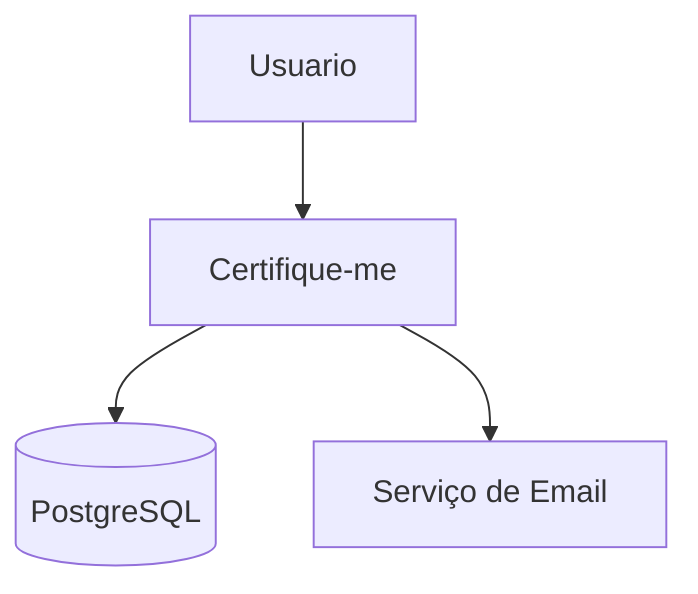
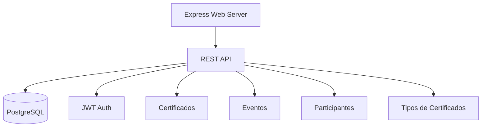
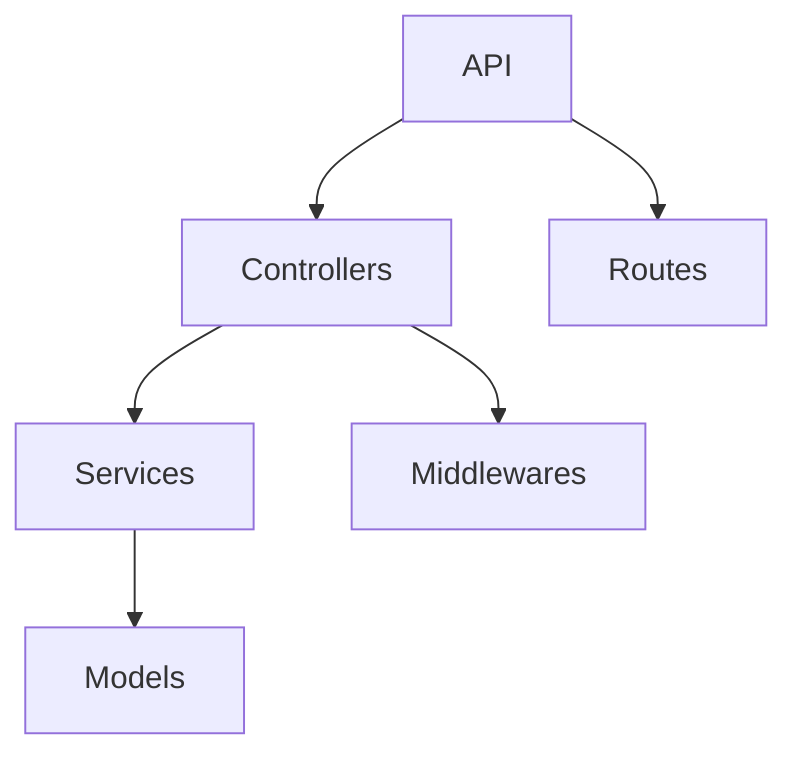

# Certifique-me — Arquitetura

## Padrão Arquitetural

- MVC em camadas
- Separação de responsabilidades: models, controllers, services, routes, middlewares

## Organização de Pastas

- src/models: definição das entidades
- src/controllers: lógica de interface
- src/services: regras de negócio
- src/routes: endpoints REST
- src/middlewares: autenticação, RBAC, escopo

## Diagramas C4

### Context Diagram (Nível 1)

### Container Diagram (Nível 2)

### Component Diagram (Nível 3)

## Acoplamento e Coesão

- Baixo acoplamento entre camadas
- Alta coesão nos módulos

## Dependências

- JWT para autenticação
- Docker para infraestrutura
