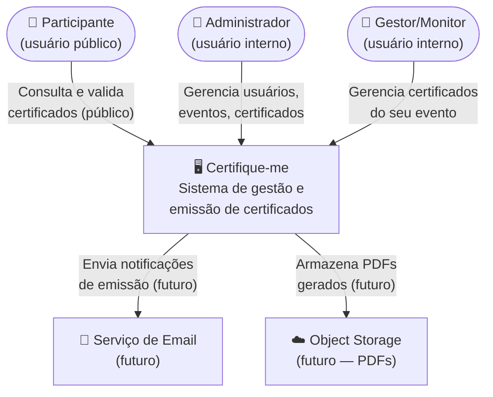
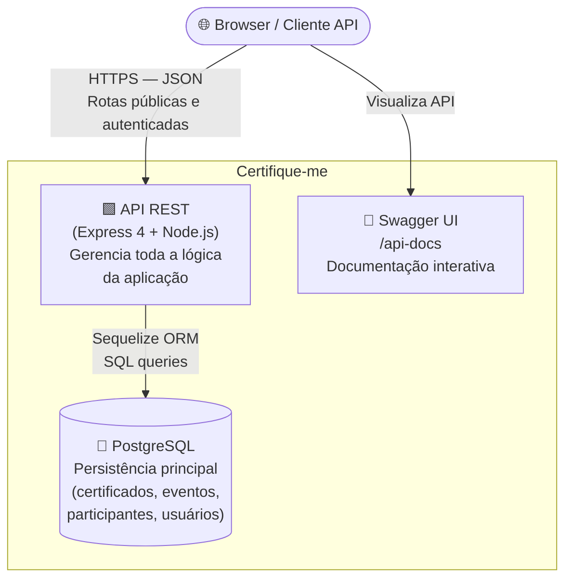
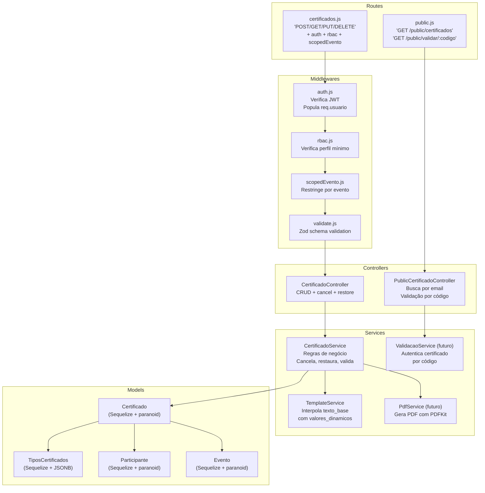

# Relatório de Auditoria Arquitetural — Certifique-me

**Auditoria:** 03  
**Data:** 2026-03-14 15:55 (BRT)  
**Tipo:** Auditoria Comparativa com Repositório Base + Architecture Stress Test  
**Repositório de referência:** [EduCompBR/educompbrasil-site — certificado.js](https://github.com/EduCompBR/educompbrasil-site/blob/master/routes/simposio/2025/educomp/pt-BR/certificado.js)

---

> **⚠️ ATENÇÃO — BUGS CRÍTICOS DESCOBERTOS**
>
> Esta auditoria identificou **três bugs que comprometem o funcionamento em produção**:
>
> 1. **`scopedEvento.js` lê `req.usuario.evento_id` inexistente** — o modelo `Usuario` usa N:N via `UsuarioEvento`; o campo direto foi removido. Gestores/monitores recebem 403 em rotas de alteração.
> 2. **`templateService.js` usa formato `{{chave}}`** enquanto a spec (FR-13) e o repositório de referência usam o formato `${campo}`. Nenhum certificado é interpolado corretamente.
> 3. **`JWT_SECRET` inconsistente**: `middleware/auth.js` usa fallback `'segredo-super-seguro'` enquanto `src/controllers/usuarioController.js` usa fallback `'secret'`. Tokens emitidos pelo `login` não são aceitos pelo `auth` em ambientes sem `.env`.

---

## ETAPA 1 — Entendimento dos Repositórios

### 1.1 Repositório Principal — Certifique-me

| Aspecto             | Detalhes                                                   |
| ------------------- | ---------------------------------------------------------- |
| **Linguagem**       | JavaScript (Node.js)                                       |
| **Runtime**         | Node.js                                                    |
| **Framework Web**   | Express 4                                                  |
| **ORM**             | Sequelize 6 (PostgreSQL)                                   |
| **Autenticação**    | JWT (`jsonwebtoken`) + bcrypt (`bcryptjs`)                 |
| **Validação**       | Zod (entrada) + Sequelize validators (modelo)              |
| **Documentação**    | Swagger/OpenAPI via `swagger-jsdoc` + `swagger-ui-express` |
| **Testes**          | Jest + Supertest                                           |
| **Containerização** | Docker + docker-compose (prod e test separados)            |
| **View Engine**     | Handlebars (hbs) — apenas para página inicial e erro       |

**Organização de diretórios:**

```
src/
  controllers/   — handlers HTTP (CertificadoController, EventoController, etc.)
  services/      — lógica de negócio (CertificadoService, TemplateService, etc.)
  models/        — entidades Sequelize (Certificado, Evento, Participante, etc.)
  routes/        — definição de rotas Express (+ Swagger JSDoc)
  middlewares/   — auth.js (JWT), rbac.js (RBAC), scopedEvento.js (escopo)
  validators/    — schemas Zod
middleware/      — auth.js legado (caminho fora de src/)
migrations/      — DDL Sequelize
tests/           — testes Jest
```

**Padrão arquitetural:** MVC em camadas — `routes → controllers → services → models`. Há clara separação de responsabilidades entre as camadas, com regras de negócio nos services e validações de entrada no Zod.

**Funcionamento em alto nível:** A API Express recebe requisições REST autenticadas via JWT. O middleware `auth` valida o token e popula `req.usuario`. O middleware `rbac` verifica o nível de acesso. O middleware `scopedEvento` restringe gestores/monitores ao seu evento. Controllers delegam para serviços que acessam os models Sequelize. Todos os recursos utilizam soft delete (`paranoid: true`).

---

### 1.2 Repositório de Referência — EduComp (educompbrasil-site)

| Aspecto                | Detalhes                                 |
| ---------------------- | ---------------------------------------- |
| **Linguagem**          | JavaScript (Node.js)                     |
| **Framework Web**      | Express + Handlebars (SSR completo)      |
| **Persistência**       | Google Sheets API (`google-spreadsheet`) |
| **Geração de PDF**     | PDFKit                                   |
| **Integração externa** | Google Service Account                   |
| **Autenticação**       | Nenhuma (sistema público)                |

**Organização de diretórios:**

```
routes/simposio/2025/educomp/pt-BR/
  certificado.js   — toda a lógica de certificados em um único arquivo
views/             — templates Handlebars para SSR
resources/         — templates PNG de certificado, fontes, PDFs gerados
```

**Padrão arquitetural:** Monolítico de rota única. O arquivo `certificado.js` contém: acesso a dados (Google Sheets), regras de negócio (interpolação, busca por email), geração de PDF (PDFKit), renderização de views (Handlebars) e I/O de arquivo. Não há separação de camadas.

**Funcionamento em alto nível:**

1. Usuário acessa a página de certificados e informa seu email
2. O sistema conecta ao Google Sheets, percorre todas as abas (tipos de certificado) e busca linhas com o email informado
3. Retorna uma lista de certificados disponíveis, renderizando uma view SSR
4. Ao clicar em "Obter certificado", o sistema gera um PDF com PDFKit usando um template PNG, interpola o `texto_base` com `${campo}`, salva temporariamente em disco e envia para download
5. A validação por código busca o certificado na planilha pelo `codigo` e exibe os dados de autenticidade

---

## ETAPA 2 — Extração de Funcionalidades do Repositório Base

### 2.1 Interface de Usuário (SSR)

| Funcionalidade                    | Objetivo                                              | Módulos               | Dependências                            |
| --------------------------------- | ----------------------------------------------------- | --------------------- | --------------------------------------- |
| Página de opções                  | Exibe links para "obter" e "validar" certificado      | `exports.opcoes`      | Handlebars view `opcoes`                |
| Formulário de busca por email     | Permite ao participante informar o email              | `exports.certificado` | view `form-obter`                       |
| Lista de certificados encontrados | Exibe todos os certificados vinculados ao email       | `exports.obter`       | view `obter-lista`, Google Sheets       |
| Formulário de validação           | Permite informar código para validar                  | `exports.formValidar` | view `form-validar`                     |
| Resultado da validação            | Exibe dados do certificado válido ou mensagem de erro | `exports.validar`     | view `validar-resultado`, Google Sheets |

### 2.2 Integração com Google Sheets (Persistência)

| Funcionalidade                        | Objetivo                                                               | Módulos                       | Dependências                                          |
| ------------------------------------- | ---------------------------------------------------------------------- | ----------------------------- | ----------------------------------------------------- |
| Leitura de planilha                   | Carrega todas as abas e linhas                                         | `doc.loadInfo()`, `getRows()` | `google-spreadsheet`, Google Service Account env vars |
| Interpretação de tipos de certificado | Aba "codigos-limpos" mapeia título → código, descrição, campo_destaque | loop sobre `sheetsByIndex`    | Planilha estruturada por convenção                    |
| Busca por email                       | Filtra linhas por email e status "liberado"                            | `forEach` no array de rows    | Planilha estruturada por convenção                    |
| Busca por código                      | Filtra linhas por código para validação                                | `forEach` no array de rows    | Planilha estruturada por convenção                    |

### 2.3 Regras de Negócio

| Funcionalidade                     | Objetivo                                                         | Módulos                             | Dependências                |
| ---------------------------------- | ---------------------------------------------------------------- | ----------------------------------- | --------------------------- |
| Interpolação de texto (`${campo}`) | Substitui variáveis no `texto_base` pelos valores do certificado | Loop manual com `indexOf("${")`     | Implementação manual inline |
| Validação de status                | Apenas certificados com `status == "liberado"` são exibidos      | `if (element.status == "liberado")` | —                           |
| Campo destaque                     | Usa `campo_destaque` da aba de tipos para exibir info principal  | `element[campo_destaque]`           | Aba "codigos-limpos"        |
| Nome em maiúsculas                 | O `nome_completo` é convertido para maiúsculas no PDF            | `.toUpperCase()`                    | —                           |

### 2.4 Geração de PDF

| Funcionalidade                 | Objetivo                                                            | Módulos                                 | Dependências                    |
| ------------------------------ | ------------------------------------------------------------------- | --------------------------------------- | ------------------------------- |
| Geração de PDF por certificado | Gera um arquivo PDF com template visual, texto interpolado e código | `exports.obterArquivo`, PDFKit          | Template PNG, fonte TTF, PDFKit |
| I/O temporário                 | Salva o PDF em disco e depois o remove após download                | `fs.createWriteStream`, `fs.unlinkSync` | Sistema de arquivos local       |
| Endereço de validação no PDF   | Imprime o link de validação com código no rodapé do PDF             | `doc.text(...)`                         | URL hardcoded                   |

### 2.5 Autenticação e Autorização

Inexistente no repositório de referência. O sistema é completamente público, sem autenticação.

### 2.6 Gestão Administrativa

Inexistente no repositório de referência. A inserção de dados é feita diretamente no Google Sheets, sem interface administrativa dedicada.

---

## ETAPA 3 — Mapeamento de Funcionalidades

### ✅ FUNCIONALIDADES JÁ IMPLEMENTADAS

| Funcionalidade                                                     | Onde está no projeto atual                                        |
| ------------------------------------------------------------------ | ----------------------------------------------------------------- |
| CRUD completo de participantes                                     | `src/routes/participantes.js` + controller + service + model      |
| CRUD completo de eventos                                           | `src/routes/eventos.js` + controller + service + model            |
| CRUD completo de tipos de certificados                             | `src/routes/tipos-certificados.js` + controller + service + model |
| Emissão, atualização, cancelamento e restauração de certificados   | `src/routes/certificados.js` + controller + service + model       |
| Tipos de certificado parametrizáveis com `dados_dinamicos` (JSONB) | `src/models/tipos_certificados.js`                                |
| Soft delete em todos os recursos                                   | `paranoid: true` em todos os models                               |
| Autenticação JWT                                                   | `middleware/auth.js` + `src/controllers/usuarioController.js`     |
| RBAC por perfil (admin, gestor, monitor)                           | `src/middlewares/rbac.js`                                         |
| Validação de entrada (Zod)                                         | `src/validators/` em todas as rotas                               |
| Documentação Swagger                                               | `app.js` + anotações JSDoc nas rotas                              |
| Health check endpoint                                              | `src/routes/health.js`                                            |
| Multi-evento por usuário (N:N)                                     | `src/models/usuario_eventos.js` + `src/models/usuario.js`         |

### ⚠️ FUNCIONALIDADES PARCIALMENTE IMPLEMENTADAS

| Funcionalidade                                 | Status                                                                                   | O que falta                                                                         |
| ---------------------------------------------- | ---------------------------------------------------------------------------------------- | ----------------------------------------------------------------------------------- |
| **Interpolação de texto**                      | `templateService.js` implementado, mas usa `{{chave}}` em vez de `${campo}`              | Corrigir o regex para `\$\{(\w+)\}` conforme spec FR-13 e repositório de referência |
| **Consulta pública de certificados por email** | Participante existe no modelo, mas não há endpoint público de busca de certif. por email | Criar `GET /public/certificados?email=...`                                          |
| **Validação pública por código**               | FR-24 especificada mas não implementada                                                  | Criar `GET /public/validar/:codigo`                                                 |
| **Escopo de evento para gestor/monitor**       | `scopedEvento.js` usa `req.usuario.evento_id` que não existe após migração para N:N      | Reescrever para carregar `eventos` via associação (`req.usuario.eventos`)           |

### ❌ FUNCIONALIDADES AUSENTES

| Funcionalidade base              | Equivalente no projeto atual                                         | Impacto                                        |
| -------------------------------- | -------------------------------------------------------------------- | ---------------------------------------------- |
| **Geração de PDF**               | Não existe                                                           | Alto — funcionalidade core para o participante |
| **Interface Web SSR**            | Apenas stubs em `views/`                                             | Médio — depende da estratégia front/back       |
| **Download de certificado**      | Não existe                                                           | Alto — bloqueador para o produto               |
| **Filtro por status "liberado"** | Status está no model mas sem lógica de filtro nas consultas públicas | Médio                                          |

### 🆕 FUNCIONALIDADES NOVAS (exclusivas do projeto atual)

| Funcionalidade                                | Valor                                                |
| --------------------------------------------- | ---------------------------------------------------- |
| Autenticação e RBAC                           | Controle de acesso robusto ausente no sistema legado |
| Gestão de usuários com perfis                 | Admin, gestor e monitor com escopos diferentes       |
| Multi-evento por usuário (N:N)                | Usuário pode gerenciar múltiplos eventos             |
| API REST documentada (Swagger)                | Integração com frontends desacoplados                |
| Soft delete com restauração                   | Rastreabilidade e recuperação de dados               |
| Validação de entrada em camada dedicada (Zod) | Defesa em profundidade                               |
| Sistema de migrations                         | Evolução controlada do schema                        |

---

## ETAPA 4 — Impacto Arquitetural das Funcionalidades

### 4.1 O que a arquitetura suporta bem

A separação em camadas `routes → controllers → services → models` cria os pontos de extensão corretos. Adicionar geração de PDF, por exemplo, requer apenas um novo serviço (`src/services/pdfService.js`) sem modificar controllers ou models. A arquitetura está preparada para absorver essas funcionalidades com baixo custo.

### 4.2 Riscos de acoplamento identificados

**Acoplamento `scopedEvento` ↔ modelo de usuário:**  
O middleware `scopedEvento.js` acessa `req.usuario.evento_id` como campo escalar, mas após a migração `20260313195000-remove-evento_id-from-usuarios.js`, esse campo não existe mais. O relacionamento passou a ser N:N. Todas as operações de gestores/monitores que passam por esse middleware estão quebradas em produção.

**Dois caminhos para `middleware/auth.js`:**  
Existe `middleware/auth.js` (raiz do projeto) e nada em `src/middlewares/auth.js`. As rotas importam o auth da raiz, mas está fisicamente separado da pasta `src/middlewares/`. Isso cria confusão de caminho e dificulta refatorações.

**`certificadoService.js` duplica `destroy` e `delete`:**  
O serviço expõe dois métodos com a mesma lógica (`destroy` e `delete`). O controller usa `delete`. Isso é dead code que pode confundir mantenedores.

**`eventoService.js` manipula `deleted_at` diretamente:**  
O método `delete` do `eventoService.js` faz `UsuarioEvento.update({ deleted_at: new Date() }, ...)` manualmente em vez de usar `UsuarioEvento.destroy({ where: { evento_id: id } })`. Isso contorna o Sequelize e pode deixar registros em estado inconsistente.

### 4.3 Novas camadas ou módulos necessários

| Módulo                             | Justificativa                                                 |
| ---------------------------------- | ------------------------------------------------------------- |
| `src/services/pdfService.js`       | Geração de PDF isolada do controller, testável e substituível |
| `src/routes/public.js`             | Rotas sem autenticação: busca por email, validação por código |
| `src/services/validacaoService.js` | Lógica de validação de autenticidade de certificado           |

---

## ETAPA 5 — Architecture Stress Test

### Cenário 1 — Crescimento de usuários (10x e 100x)

**10x (~1.000 usuários concorrentes):**  
O servidor Express single-process em um único contêiner entra em saturação. O pool de conexões do Sequelize (padrão: 5 conexões) se torna gargalo imediato. O PostgreSQL aguenta, mas a camada de aplicação não distribui carga.

**100x (~10.000 usuários concorrentes):**  
Sem load balancer, sem clustering Node.js (`cluster` module ou PM2), sem cache: indisponibilidade total. O JWT stateless é um ponto positivo — escalar horizontalmente a API é viável sem sessões compartilhadas.

**Gargalo principal:** Ausência de estratégia de escalabilidade horizontal (processo único, sem clustering).

### Cenário 2 — Crescimento de volume de dados

Certificados com `valores_dinamicos` (JSONB) crescem sem índices funcionais. Consultas como "buscar todos os certificados de um evento" sem paginação retornam N registros completos na memória do processo Node.js.

**Gargalo principal:** Falta de paginação e índices compostos em colunas de alta cardinalidade (`evento_id`, `participante_id`, `status`).

### Cenário 3 — Concorrência e requisições simultâneas

Node.js lida bem com I/O assíncrono, mas a geração de PDF (quando implementada com PDFKit) é CPU-bound e bloqueia o event loop. Operações pesadas devem ser delegadas a workers ou filas.

**Gargalo principal:** Geração de PDF síncrona no event loop principal (risco futuro quando implementada).

### Cenário 4 — Introdução de novas funcionalidades complexas

A arquitetura em camadas suporta bem novas funcionalidades. O risco está nos modelos com JSONB: adicionar novos campos em `dados_dinamicos` sem versionamento de schema pode quebrar certificados antigos durante interpolação.

**Gargalo principal:** JSONB sem schema versionado — evolução de `dados_dinamicos` pode invalidar certificados já emitidos.

### Cenário 5 — Mudanças frequentes em regras de negócio

Regras de negócio como "quais campos são obrigatórios por tipo de certificado" vivem dispersas entre validators Zod, hooks do Sequelize e serviços. Uma mudança de rule pode exigir alterações em três camadas.

**Gargalo principal:** Lógica de validação distribuída entre Zod, Sequelize validators e hooks — sem uma única fonte de verdade para as regras de domínio.

### Cenário 6 — Integração com sistemas externos

A arquitetura é compatível com integrações externas (email, armazenamento em nuvem para PDFs, SSO). Não há camada de integração dedicada (adapter/port), o que significa que integrações seriam acopladas diretamente nos serviços.

**Gargalo principal:** Ausência de padrão de adapter para integrações externas — cada integração exigiria modificações diretas nos services.

### Cenário 7 — Falhas em componentes críticos

Se o PostgreSQL ficar indisponível, o `/health` retorna 503 corretamente. Porém, nenhuma rota tem circuit breaker ou retry logic — qualquer falha momentânea de banco resulta em erro 500 não tratado.

**Gargalo principal:** Ausência de circuit breaker e tratamento de falhas transitórias de banco.

---

## ETAPA 6 — Gargalos Arquiteturais

### G1 — `scopedEvento.js` quebrado após migração N:N 🔴

**Problema:** O middleware usa `req.usuario.evento_id` (campo removido) para determinar o escopo do gestor/monitor. Após a migração para N:N (`usuario_eventos`), esse campo nunca existe em `req.usuario`, causando resposta 403 constante.

**Impacto:** Gestores e monitores são bloqueados em todas as operações de alteração — a feature de RBAC por escopo é inoperante.

### G2 — `JWT_SECRET` duplicado com fallbacks diferentes 🔴

**Problema:** `middleware/auth.js` usa `|| 'segredo-super-seguro'` como fallback; `src/controllers/usuarioController.js` usa `|| 'secret'`. Em ambientes sem `.env`, o token é assinado com `'secret'` mas verificado com `'segredo-super-seguro'` — autenticação sempre falha.

**Impacto:** Login retorna token, mas toda requisição autenticada retorna 401 "Token inválido" quando `JWT_SECRET` não está configurado.

### G3 — `templateService.js` com formato errado 🔴

**Problema:** A especificação (FR-13) e o repositório de referência usam `${campo}`. O `templateService.js` implementado usa `{{chave}}`. Nenhuma interpolação funciona.

**Impacto:** O texto do certificado gerado nunca tem as variáveis substituídas — todos os certificados saem com os placeholders sem substituição.

### G4 — `middleware/auth.js` fora de `src/` 🟡

**Problema:** O arquivo de autenticação está em `middleware/auth.js` (pasta raiz), enquanto `rbac.js` e `scopedEvento.js` estão em `src/middlewares/`. Rotas importam de caminhos inconsistentes.

**Impacto:** Confusão de refatoração; dificulta encontrar e atualizar o middleware.

### G5 — Falta de paginação nas listagens 🟡

**Problema:** `findAll()` em todos os serviços retorna todos os registros sem limite. Para eventos com milhares de participantes e certificados, isso pode saturar a memória.

**Impacto:** Degradação de performance crescente à medida que o volume de dados aumenta.

### G6 — `eventoService.delete` manipula `deleted_at` manualmente 🟡

**Problema:** O serviço faz `UsuarioEvento.update({ deleted_at: new Date() }, ...)` em vez de `UsuarioEvento.destroy()`. Isso bypassa o Sequelize paranoid e pode não restaurar corretamente as associações.

**Impacto:** Cascata de soft delete inconsistente — ao restaurar um evento, as associações de `usuario_eventos` não são restauradas.

### G7 — Sem validação de `valores_dinamicos` vs `dados_dinamicos` 🟡

**Problema:** Ao emitir um certificado, `valores_dinamicos` é aceito sem validação contra o schema `dados_dinamicos` do tipo de certificado associado. Campos extras ou ausentes não são detectados.

**Impacto:** Certificados emitidos com dados incompletos passam validação mas falham na interpolação do texto.

### G8 — `certificadoService` duplica `destroy`/`delete` 🟢

**Problema:** Os métodos `destroy` e `delete` têm a mesma implementação. O controller usa apenas `delete`.

**Impacto:** Dead code que confunde leitores do código.

---

## ETAPA 7 — Dívida Técnica Potencial

### 🔴 ALTO RISCO

| Item                                                 | Consequência                                                                         |
| ---------------------------------------------------- | ------------------------------------------------------------------------------------ |
| **G1 — scopedEvento quebrado**                       | RBAC por escopo inoperante; gestores/monitores não conseguem trabalhar               |
| **G2 — JWT_SECRET inconsistente**                    | Autenticação falha em ambientes sem `.env`; difícil de diagnosticar                  |
| **G3 — templateService formato errado**              | Todos os certificados emitidos têm texto incorreto; rerenderização futura necessária |
| **Ausência de rota pública de consulta e validação** | Funcionalidade core (FR-23, FR-24) inexistente; bloqueador de produto                |
| **Ausência de geração de PDF**                       | Principal entregável para o participante inexistente                                 |

### 🟡 MÉDIO RISCO

| Item                                          | Consequência                                                                                               |
| --------------------------------------------- | ---------------------------------------------------------------------------------------------------------- |
| **G4 — middleware/auth.js fora de src/**      | Refatorações futuras quebram imports em locais inesperados                                                 |
| **G5 — sem paginação**                        | Performance degrada linearmente com volume; migração para paginação exige mudança de API (breaking change) |
| **G6 — cascata de soft delete inconsistente** | Restauração de eventos pode deixar usuários desvinculados                                                  |
| **G7 — sem validação de valores_dinamicos**   | Certificados malformados persistem no banco silenciosamente                                                |
| **Sem rate limiting**                         | Endpoint `/login` vulnerável a force brute; demais endpoints expostos a abuso                              |
| **Sem logging estruturado**                   | Diagnóstico de erros em produção depende do `morgan` que não persiste logs                                 |

### 🟢 BAIXO RISCO

| Item                                             | Consequência                                                         |
| ------------------------------------------------ | -------------------------------------------------------------------- |
| **G8 — destroy/delete duplicados**               | Confusão de leitura; sem impacto funcional                           |
| **Swagger sem exemplos e sem modelos completos** | Documentação insuficiente para consumo da API por terceiros          |
| **Sem testes de integração end-to-end**          | Regressões em fluxos completos (emitir → validar) não são detectadas |
| **Views Handlebars vazias**                      | Se o produto incluir SSR, o trabalho de front não está iniciado      |

---

## ETAPA 8 — Decisões Arquiteturais Pendentes

As seguintes decisões devem ser formalizadas como ADRs:

### ADR-004 — Estratégia de Geração de PDF

**Questão:** Usar PDFKit (como referência), Puppeteer (HTML→PDF), ou serviço externo (ex.: AWS Lambda com template)?

**Fatores:**

- PDFKit: leve, sem dependências de navegador, mas baixo nível
- Puppeteer: fácil criação de templates HTML/CSS, mas pesado (Chromium)
- Externo: desacoplado, mas latência e custo

**Recomendação:** Criar `src/services/pdfService.js` com interface agnóstica de implementação; decidir a engine em ADR-004.

### ADR-005 — Modelo de Vínculo Usuário-Evento: N:N vs FK Simples

**Questão:** A spec FR-32 diz "gestores e monitores devem estar vinculados a exatamente um evento". O modelo atual usa N:N.

**Problema:** N:N permite múltiplos eventos, mas o escopo (`scopedEvento`) foi projetado para FK simples. A decisão arquitetural e o código estão em conflito.

**Recomendação:** Decidir e documentar: se o requisito é "exatamente um evento", reverter para FK simples; se "múltiplos eventos" é desejado, atualizar spec, scopedEvento e documentar.

### ADR-006 — Estratégia de Paginação da API

**Questão:** Cursor-based vs offset-based? Padrão de resposta (`{ data, meta, links }` vs array puro)?

**Recomendação:** Offset-based para simplicidade inicial; envelope de resposta `{ data: [], meta: { total, page, perPage } }`.

### ADR-007 — Validação de `valores_dinamicos` contra `dados_dinamicos`

**Questão:** Validar no Zod (antes de chegar ao service), no service (lógica de negócio) ou no model (hook Sequelize)?

**Recomendação:** Validar no service (`certificadoService.create`), onde o tipo de certificado já está carregado e a lógica de domínio é central.

### ADR-008 — Estratégia de Armazenamento de PDFs Gerados

**Questão:** Salvar localmente no servidor (como a referência faz temporariamente), em object storage (S3/MinIO), ou gerar sob demanda?

**Recomendação:** Geração sob demanda para MVP; migrar para armazenamento em nuvem no Fase 2.

---

## ETAPA 9 — Ajustes Recomendados

### 🔴 CRÍTICAS

**C1 — Corrigir `templateService.js` para usar formato `${campo}`**

```javascript
// src/services/templateService.js — ATUAL (incorreto)
return textoBase.replace(/\{\{(\w+)\}\}/g, (match, chave) => {
  return chave in valoresDinamicos ? valoresDinamicos[chave] : match
})

// CORRETO (alinhado com spec FR-13 e repositório de referência)
return textoBase.replace(/\$\{(\w+)\}/g, (match, chave) => {
  return chave in valoresDinamicos ? valoresDinamicos[chave] : match
})
```

**C2 — Corrigir `JWT_SECRET` inconsistente**

```javascript
// middleware/auth.js — remover fallback inseguro
const secret = process.env.JWT_SECRET
if (!secret) throw new Error('JWT_SECRET não configurado')

// src/controllers/usuarioController.js — usar mesma variável
const JWT_SECRET = process.env.JWT_SECRET
if (!JWT_SECRET) throw new Error('JWT_SECRET não configurado')
```

**C3 — Corrigir `scopedEvento.js` para N:N**

```javascript
// Antes: req.usuario.evento_id (não existe após migração)
// Depois: carregar eventos do usuário via associação

module.exports = async function scopedEvento(req, res, next) {
  if (req.usuario.perfil === 'admin') return next()

  const eventosDoUsuario = await req.usuario.getEventos()
  const idsEventos = eventosDoUsuario.map((e) => e.id)

  if (!idsEventos.length) {
    return res.status(403).json({ error: 'Usuário sem evento vinculado.' })
  }

  // Para listagem: filtrar pelo evento do usuário
  if (req.method === 'GET' && !req.params.id) {
    if (
      req.query.evento_id &&
      !idsEventos.includes(Number(req.query.evento_id))
    ) {
      return res
        .status(403)
        .json({ error: 'Acesso restrito ao evento vinculado.' })
    }
    if (!req.query.evento_id) req.query.evento_id = idsEventos[0]
    return next()
  }

  const eventoId = Number(req.body.evento_id || req.params.eventoId)
  if (eventoId && idsEventos.includes(eventoId)) return next()

  return res.status(403).json({ error: 'Acesso restrito ao evento vinculado.' })
}
```

**C4 — Implementar rotas públicas de consulta e validação**

```javascript
// src/routes/public.js
router.get('/certificados', publicCertificadoController.findByEmail) // FR-23
router.get('/validar/:codigo', publicCertificadoController.validate) // FR-24
```

### 🟡 IMPORTANTES

**I1 — Mover `middleware/auth.js` para `src/middlewares/auth.js`**

Centralizar todos os middlewares em `src/middlewares/` e atualizar os imports em todas as rotas.

**I2 — Adicionar paginação nas listagens**

```javascript
// src/services/certificadoService.js
async findAll({ page = 1, perPage = 20, eventoId } = {}) {
  const where = eventoId ? { evento_id: eventoId } : {}
  const { count, rows } = await Certificado.findAndCountAll({
    where,
    limit: perPage,
    offset: (page - 1) * perPage,
    order: [['created_at', 'DESC']],
  })
  return { data: rows, meta: { total: count, page, perPage } }
}
```

**I3 — Adicionar rate limiting no endpoints de auth**

```javascript
// app.js
const rateLimit = require('express-rate-limit')
app.use('/usuarios/login', rateLimit({ windowMs: 15 * 60 * 1000, max: 20 }))
```

**I4 — Corrigir cascata de soft delete em `eventoService`**

```javascript
// Substituir update manual por destroy com paranoid
async delete(id) {
  const evento = await Evento.findByPk(id)
  if (!evento) return null
  await UsuarioEvento.destroy({ where: { evento_id: id } }) // usa paranoid
  return evento.destroy()
}
```

**I5 — Validar `valores_dinamicos` no `certificadoService.create`**

```javascript
async create(data) {
  const tipo = await TiposCertificados.findByPk(data.tipo_certificado_id)
  if (!tipo) throw new Error('Tipo de certificado não encontrado')
  const camposEsperados = Object.keys(tipo.dados_dinamicos || {})
  const camposFornecidos = Object.keys(data.valores_dinamicos || {})
  const faltando = camposEsperados.filter(c => !camposFornecidos.includes(c))
  if (faltando.length) throw new Error(`Campos obrigatórios ausentes: ${faltando.join(', ')}`)
  return Certificado.create(data)
}
```

### 🟢 OPCIONAIS

**O1 — Implementar `pdfService.js`**

Criar `src/services/pdfService.js` com interface baseada em PDFKit, inicialmente equivalente ao repositório de referência.

**O2 — Adicionar logging estruturado**

Substituir `morgan` por `pino` ou `winston` com saída JSON para facilitar correlação de logs em produção.

**O3 — Adicionar índices de banco de dados**

```sql
CREATE INDEX idx_certificados_evento_id ON certificados(evento_id);
CREATE INDEX idx_certificados_participante_id ON certificados(participante_id);
CREATE INDEX idx_certificados_status ON certificados(status);
CREATE UNIQUE INDEX idx_certificados_codigo ON certificados(codigo) WHERE deleted_at IS NULL;
```

**O4 — Remover método `destroy` duplicado de `certificadoService`**

---

## ETAPA 10 — Impacto no Backlog Técnico

### Análise do Backlog Atual

Todos os épicos 1–5 do backlog foram concluídos. As tasks registradas foram executadas com qualidade, porém três bugs críticos foram introduzidos durante a implementação (C1, C2, C3 acima). O backlog precisa de novos épicos para cobrir as funcionalidades ausentes e corrigir os bugs.

### Novas Tarefas Sugeridas

| Task                                                                              | Prioridade | Épico                      | Motivo                                                |
| --------------------------------------------------------------------------------- | ---------- | -------------------------- | ----------------------------------------------------- |
| **TASK-16** 🔴 Corrigir `templateService.js` (formato `${campo}`)                 | Crítica    | Novo: Bugfixes             | Bug que impede funcionamento de certificados          |
| **TASK-17** 🔴 Corrigir `JWT_SECRET` inconsistente                                | Crítica    | Novo: Bugfixes             | Bug de autenticação em produção                       |
| **TASK-18** 🔴 Corrigir `scopedEvento.js` para modelo N:N                         | Crítica    | Novo: Bugfixes             | RBAC inoperante para gestores/monitores               |
| **TASK-19** 🔴 Implementar rotas públicas (FR-23, FR-24)                          | Crítica    | Novo: Funcionalidades Core | Bloqueador de produto — validação pública inexistente |
| **TASK-20** 🔴 Implementar geração de PDF (`pdfService.js`)                       | Crítica    | Novo: Funcionalidades Core | Funcionalidade principal para o participante          |
| **TASK-21** 🟡 Mover `middleware/auth.js` para `src/middlewares/`                 | Importante | Épico 2                    | Consistência arquitetural                             |
| **TASK-22** 🟡 Adicionar paginação nas listagens                                  | Importante | Épico 3                    | Escalabilidade                                        |
| **TASK-23** 🟡 Validar `valores_dinamicos` no service                             | Importante | Épico 2                    | Integridade de dados                                  |
| **TASK-24** 🟡 Corrigir cascata de soft delete em eventos                         | Importante | Épico 1                    | Consistência de dados                                 |
| **TASK-25** 🟡 Rate limiting em endpoints de auth                                 | Importante | Novo: Segurança            | OWASP A07                                             |
| **TASK-26** 🟢 Documentar ADR-004 a ADR-008                                       | Opcional   | Épico 4                    | Formalizar decisões pendentes                         |
| **TASK-27** 🟢 Adicionar índices no banco para certificados/participantes/eventos | Opcional   | Épico 1                    | Performance                                           |

### Tarefas a Re-priorizar

- **TASK-15 (Swagger)**: Está marcada como concluída, mas os schemas de `public.js` (rotas sem auth) ainda não existem. Reabrir para cobrir as novas rotas.
- **TASK-11 (Documentação)**: A `docs/arquitetura.md` está com C4 Model superficial. Atualizar com o diagrama revisado desta auditoria.

### Tarefas que Podem Ser Simplificadas

- **TASK-09 (validação cross-field)**: Já implementada via `beforeValidate` hook. Pode ser marcada como completa sem pendências.

---

## ETAPA 11 — Evolução da Arquitetura

### Fase 1 — MVP (atual → ~3 meses)

**Objetivo:** Paridade funcional com o repositório de referência, mas com qualidade superior.

**Mudanças necessárias:**

- Corrigir os 3 bugs críticos (C1, C2, C3)
- Implementar rotas públicas de consulta e validação (TASK-19)
- Implementar geração de PDF básica (TASK-20)
- Mover `middleware/auth.js` para `src/middlewares/` (TASK-21)
- Validar `valores_dinamicos` no service (TASK-23)

**Arquitetura nesta fase:** Monolito Express em camadas, PostgreSQL single instance, sem cache, sem filas. Adequado para volume baixo (~centenas de certificados por evento).

```
Express API (monolito em camadas)
    └── PostgreSQL (single instance)
```

### Fase 2 — Crescimento (3–12 meses)

**Objetivo:** Suportar múltiplos eventos simultâneos com volume médio (~10.000 certificados/evento).

**Mudanças necessárias:**

- Paginação em todas as listagens (TASK-22)
- Rate limiting (TASK-25)
- Logging estruturado (O2)
- Índices de banco de dados (TASK-27)
- Armazenamento de PDFs em object storage (S3/MinIO)
- Dockerfile multi-stage para imagem de produção otimizada
- Processo de CI/CD automatizado com deploy

**Mudanças arquiteturais naturais:**

- Clustering com PM2 (múltiplos workers Node.js)
- Pool de conexões ajustado
- Cache Redis para certificados de alta demanda (validação pública)

```
Load Balancer (nginx)
    ├── Express API (PM2 cluster, n workers)
    ├── PostgreSQL (primary + replica read)
    ├── Redis (cache de validação pública)
    └── S3/MinIO (PDFs gerados)
```

### Fase 3 — Escala e Maturidade (12+ meses)

**Objetivo:** Suportar dezenas de eventos simultâneos, alta concorrência, integrações externas (SSO, email).

**Mudanças arquiteturais:**

- Separar geração de PDF em worker assíncrono (fila BullMQ + Redis)
- Background jobs para envio de email após emissão de certificado
- Feature flags para rollout progressivo
- Observabilidade: métricas (Prometheus/Grafana), tracing distribuído (OpenTelemetry)
- Possível extração de micro-serviço para geração de PDF se o volume justificar

```
API Gateway
    ├── API Express (stateless, auto-scale)
    ├── Worker Service (geração de PDF, envio de email)
    │       └── Queue (Redis/BullMQ)
    ├── PostgreSQL (HA com failover)
    ├── Redis (cache + sessões de fila)
    ├── Object Storage (PDFs, templates)
    └── Observabilidade (Prometheus, Grafana, OpenTelemetry)
```

---

## ETAPA 12 — Atualização do C4 Model

O C4 Model atual em `docs/arquitetura.md` é incompleto. Abaixo está a versão revisada.

### Context Diagram (Nível 1)



### Container Diagram (Nível 2)



### Component Diagram (Nível 3) — Módulo de Certificados



---

## Sumário Executivo

| Categoria                    | Qtd | Destaques                                                                |
| ---------------------------- | --- | ------------------------------------------------------------------------ |
| **Bugs críticos**            | 3   | JWT inconsistente, templateService formato errado, scopedEvento quebrado |
| **Funcionalidades ausentes** | 4   | PDF, rota pública, validação por código, filtro por status               |
| **Funcionalidades parciais** | 4   | Interpolação, busca por email, validação pública, escopo de evento       |
| **Gargalos identificados**   | 8   | Ver Etapa 6                                                              |
| **Novas tarefas sugeridas**  | 12  | TASK-16 a TASK-27                                                        |
| **ADRs pendentes**           | 5   | ADR-004 a ADR-008                                                        |

**Prioridade imediata:** Corrigir TASK-16, TASK-17 e TASK-18 antes de qualquer deploy. Essas três correções desbloqueiam autenticação, interpolação e RBAC — as três features mais críticas do sistema.
