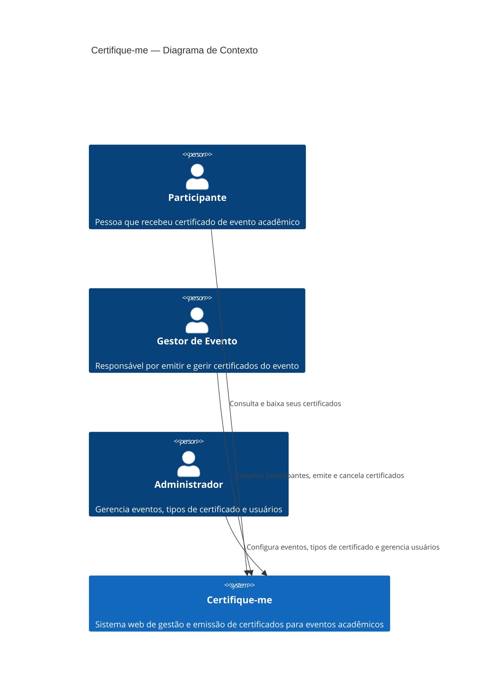
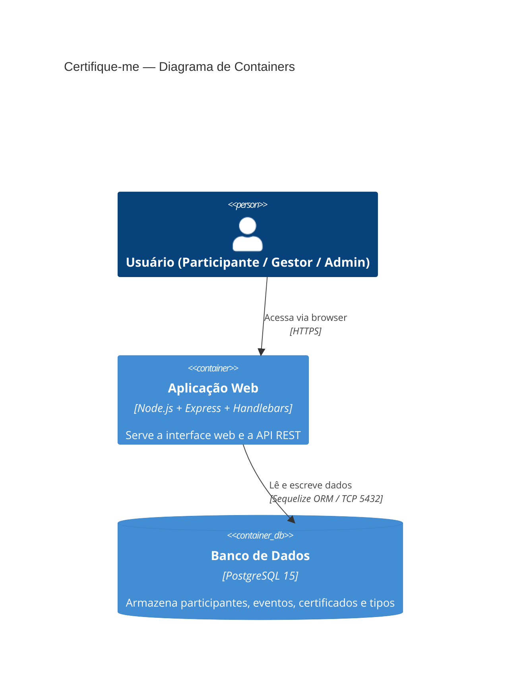
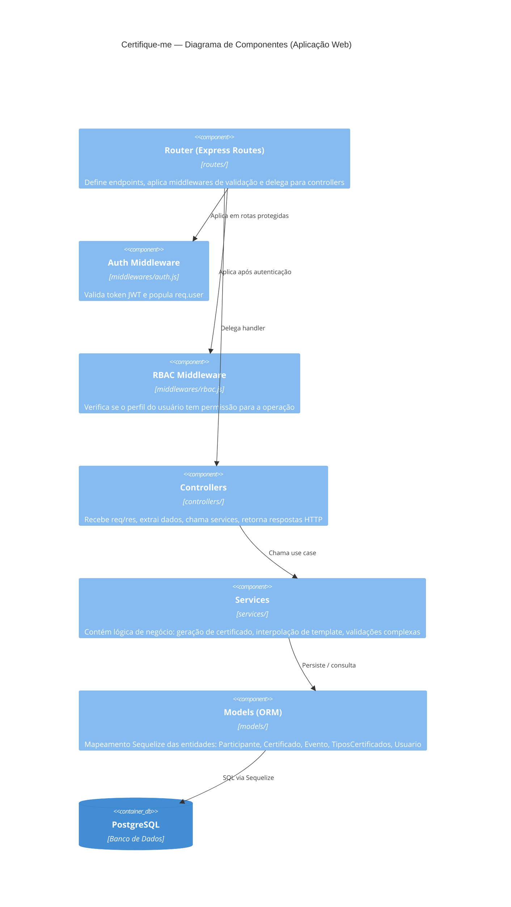
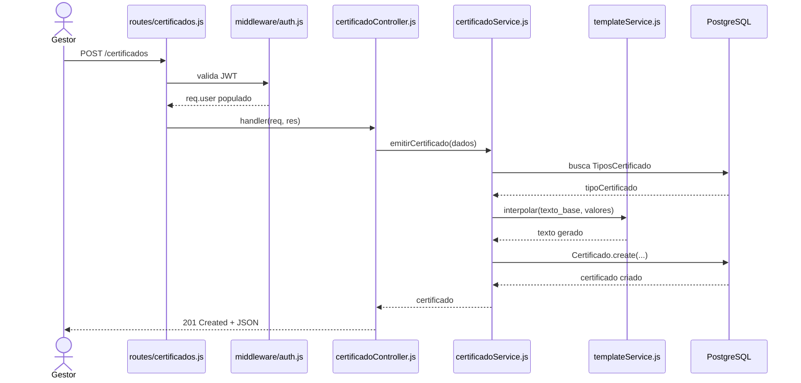

# Prompt de solicitação da auditoria

@workspace

Você é um arquiteto de software sênior especializado em engenharia de software, arquitetura limpa e documentação técnica.

Analise todo o repositório atualmente aberto no workspace e realize uma auditoria arquitetural completa do projeto.

Estruture sua resposta nas etapas abaixo.

ETAPA 1 — Entendimento do Projeto
Analise o repositório e descreva:

- tecnologias e linguagens utilizadas
- frameworks e bibliotecas principais
- estrutura de diretórios do projeto
- módulos ou componentes principais
- padrão arquitetural aparente (por exemplo: MVC, monólito em camadas, hexagonal, clean architecture, modular, etc.)

Explique brevemente como o sistema parece funcionar com base no código disponível.

ETAPA 2 — Análise da Arquitetura Atual
Avalie a organização do projeto considerando:

- modularização
- separação de responsabilidades
- organização de pastas
- dependências entre módulos
- nível de acoplamento
- reutilização de código

Verifique se o projeto segue boas práticas de engenharia de software como:

- SOLID
- Separation of Concerns
- Clean Architecture
- Domain-Driven Design (quando aplicável)

ETAPA 3 — Identificação de Problemas
Identifique possíveis problemas arquiteturais ou estruturais, como:

- arquivos com responsabilidades excessivas
- dependências circulares
- lógica de domínio misturada com infraestrutura
- duplicação de código
- baixa coesão entre módulos
- alta dependência entre camadas
- organização confusa de diretórios
- ausência ou insuficiência de documentação

Liste os problemas de forma clara.

ETAPA 4 — Recomendações de Melhoria
Sugira melhorias arquiteturais concretas.

Organize as recomendações em três níveis:

CRÍTICAS
Problemas que podem comprometer manutenção ou evolução do projeto.

IMPORTANTES
Melhorias que aumentariam a qualidade da arquitetura.

OPCIONAIS
Boas práticas adicionais.

Sempre que possível, sugira:

- refatoração de módulos
- reorganização de diretórios
- separação de camadas
- introdução de abstrações
- padrões arquiteturais mais adequados

ETAPA 5 — Estrutura Ideal do Repositório
Proponha uma estrutura de diretórios ideal para este projeto.

Mostre uma árvore de arquivos exemplo, como:

repo/
├ docs/
├ src/
│ ├ domain/
│ ├ application/
│ ├ infrastructure/
│ └ interfaces/
├ tests/
└ README.md

Explique brevemente a função de cada diretório.

ETAPA 6 — Proposta de Documentação Técnica
Com base no código analisado, proponha uma estrutura completa de documentação técnica dentro de uma pasta /docs.

Sugira arquivos como:

docs/
├ visao-geral.md
├ arquitetura.md
├ modulos.md
├ api.md
├ desenvolvimento.md
├ deploy.md
└ decisoes/

Explique o que cada documento deve conter.

ETAPA 7 — Criação do C4 Model
Gere uma proposta de documentação arquitetural baseada no C4 Model contendo:

- Context Diagram (nível 1)
- Container Diagram (nível 2)
- Component Diagram (nível 3)

Descreva os elementos principais de cada nível.

Sempre que possível, forneça exemplos de diagramas usando sintaxe compatível com ferramentas como Mermaid ou PlantUML.

ETAPA 8 — Próximos Passos
Liste quais arquivos ou partes do código deveriam ser analisados em maior profundidade para melhorar a análise arquitetural.

Se necessário, peça explicitamente para que arquivos específicos sejam abertos para análise mais detalhada.

---

# Auditoria Arquitetural — Certifique-me

---

## ETAPA 1 — Entendimento do Projeto

### Tecnologias e Linguagens

| Categoria             | Tecnologias                    |
| --------------------- | ------------------------------ |
| Linguagem             | JavaScript (Node.js, CommonJS) |
| Runtime               | Node.js 22                     |
| Banco de dados        | PostgreSQL 15                  |
| ORM                   | Sequelize 6                    |
| Framework Web         | Express 4                      |
| Template Engine       | Handlebars (hbs)               |
| Testes                | Jest + Supertest               |
| Containerização       | Docker + Docker Compose        |
| Variáveis de ambiente | dotenv                         |

### Estrutura de Diretórios Atual

```
certifique-me/
├── app.js                      ← Bootstrap do Express
├── bin/www                     ← Entrypoint HTTP
├── config/
│   └── database.js             ← Configuração Sequelize (dev/test/prod)
├── docs/
│   └── ESPECIFICACOES.md       ← Única documentação existente
├── migrations/                 ← Vazio (sem migrações criadas)
├── models/
│   ├── index.js                ← Loader automático via fs.readdirSync
│   ├── participante.js
│   ├── certificado.js
│   ├── evento.js
│   └── tipos_certificados.js
├── routes/
│   ├── index.js                ← Apenas renderiza a home
│   └── users.js                ← Stub gerado pelo Express
├── seeders/                    ← Vazio
├── tests/
│   ├── setup.js                ← Global beforeAll/afterAll
│   └── models/
│       ├── participante.test.js
│       ├── certificado.test.js
│       ├── evento.test.js
│       └── tipos_certificados.test.js
├── views/
│   ├── layout.hbs
│   ├── index.hbs
│   └── error.hbs
├── docker-compose.yml
├── Dockerfile
├── jest.config.js
└── package.json
```

### Padrão Arquitetural Identificado

O projeto segue um **MVC monolítico em camadas iniciais**, scaffold padrão do `express-generator`, com os modelos Sequelize sendo a camada mais desenvolvida até o momento. Não há controllers implementados — toda a lógica de negócio que existir no futuro estaria dentro das rotas diretamente, típico de projetos iniciais Express sem separação de camadas.

### Como o sistema funciona

O projeto gerencia **certificados de eventos acadêmicos**. Participantes são vinculados a certificados, que por sua vez referenciam eventos e tipos de certificado. O `TiposCertificados` define um template com `texto_base` (com interpolação de variáveis `${...}`) e `dados_dinamicos` (JSONB), enquanto `Certificado.valores_dinamicos` (JSONB) armazena os valores concretos de cada instância. As especificações também preveem um model `Usuario` (admin/gestor/monitor) com escopo por evento, mas ele ainda não foi implementado.

---

## ETAPA 2 — Análise da Arquitetura Atual

### Modularização

Os modelos estão bem isolados entre si e respeitam o padrão Sequelize. O index.js usa `fs.readdirSync` para carregamento dinâmico — funcional, mas difícil de rastrear estaticamente por ferramentas de análise e TypeScript.

### Separação de Responsabilidades

| Camada             | Status                    |
| ------------------ | ------------------------- |
| Modelos (domínio)  | Parcialmente implementado |
| Controllers        | **Ausente**               |
| Serviços/Use Cases | **Ausente**               |
| Rotas              | Apenas stubs              |
| Views              | Apenas scaffold           |

Toda lógica de negócio futura está em risco de ser acumulada diretamente nos handlers de rota (`routes/*.js`), o que viola o princípio de Single Responsibility.

### Dependências Entre Módulos

```
app.js → routes/index.js, routes/users.js
models/index.js → todos os models
models/certificado.js → belongsTo Participante, Evento, TiposCertificados
config/database.js ← models/index.js
```

Não há dependências circulares identificadas. O acoplamento atual é baixo por ser um projeto em estágio inicial.

### Observância de Boas Práticas

| Prática                                | Status                                                    |
| -------------------------------------- | --------------------------------------------------------- |
| Validações no modelo                   | Sim (allowNull, validate, ENUM)                           |
| Soft delete (paranoid)                 | Sim, em todos os modelos                                  |
| Separação de ambientes (dev/test/prod) | Sim, em database.js                                       |
| Testes automatizados                   | Sim, cobertura de modelos                                 |
| SOLID / Clean Architecture             | Não aplicado — estrutura plana                            |
| DDD                                    | Não iniciado                                              |
| Migrations                             | **Ausentes** — utiliza `sync({ force: true })` nos testes |
| Seeders                                | **Ausentes**                                              |
| Autenticação/Autorização               | **Ausente**                                               |

---

## ETAPA 3 — Identificação de Problemas

### P1 — Ausência total de migrations

migrations está vazio. O schema do banco é controlado apenas via `sequelize.sync({ force: true })` no setup de testes, o que **destrói dados** a cada execução. Em produção, não há como evoluir o schema de forma controlada.

### P2 — Ausência de controllers

Não existe camada de controllers. Toda lógica de negócio será misturada com tratamento de requisições HTTP nas rotas — violação direta de Separation of Concerns e SRP (SOLID).

### P3 — Ausência de camada de serviços/use cases

Operações de negócio (geração de certificado, validação de template, envio de certificado) não têm lugar estruturado — sem service layer, isso acumula em rotas ou modelos.

### P4 — index.js com carregamento dinâmico via `fs.readdirSync`

O loader usa reflexão em tempo de execução e lê arquivos do sistema. Isso impede análise estática, dificulta tree-shaking, e pode carregar arquivos inesperados se o diretório for contaminado.

### P5 — Rotas users.js é um stub não utilizado

`/users` retorna apenas uma string — app.js registra uma rota que não representa nenhum recurso real do domínio.

### P6 — Configuração de banco com credenciais default hard-coded

Em database.js, fallbacks como `'password'` são usados quando variáveis de ambiente não estão definidas. Em ambientes de CI/CD ou staging mal configurados, isso pode expor credenciais fracas.

### P7 — Ausência de autenticação e autorização

O model `Usuario` com perfis `admin/gestor/monitor` está especificado em ESPECIFICACOES.md mas não implementado. Nenhuma rota é protegida. Qualquer implementação de rotas abrirá endpoints desprotegidos.

### P8 — docker-compose.yml expõe banco de teste na porta 5433

O banco de teste (`postgres_test`) é definido no mesmo docker-compose.yml de produção, expondo infraestrutura de desenvolvimento junto à de produção.

### P9 — package.json com nome genérico

O projeto se chama `"my-express-app"` — scaffold padrão, sem identidade. Isso causa confusão em logs e monitoramento.

### P10 — Ausência de documentação técnica operacional

docs contém apenas ESPECIFICACOES.md. Não há arquitetura documentada, guia de desenvolvimento, documentação de API, ou decision log.

### P11 — Validação cross-field frágil em `TiposCertificados`

A validação de `campo_destaque` via `this.dados_dinamicos` dentro do validator do Sequelize é dependente de ordem de definição dos campos no objeto — comportamento não garantido e potencialmente inconsistente entre hooks do ORM.

### P12 — Sem variável `.env.example`

Não há arquivo `.env.example` para guiar a configuração de ambiente. Novos desenvolvedores não sabem quais variáveis configurar.

---

## ETAPA 4 — Recomendações de Melhoria

### CRÍTICAS

**C1 — Criar migrations Sequelize para todos os modelos**
Execute `sequelize-cli migration:generate` para cada model e implemente `up`/`down` com todas as colunas, índices e foreign keys. Remova `sync({ force: true })` dos testes — use migrations aplicadas via `sequelize db:migrate` no setup de CI.

**C2 — Introduzir camada de controllers**
Crie `controllers/` com um controller por entidade de domínio:

```
controllers/
├── participanteController.js
├── certificadoController.js
├── eventoController.js
└── tiposCertificadosController.js
```

Cada controller exporta funções puras `(req, res, next)` que delegam para serviços — sem lógica de negócio direta.

**C3 — Implementar autenticação antes de expor qualquer rota**
Crie o model `Usuario` e implemente middleware JWT ou session-based antes de qualquer endpoint de gestão ser exposto. Implemente RBAC (Role-Based Access Control) com os perfis definidos.

**C4 — Remover credenciais default do database.js**
Substitua todos os fallbacks `|| 'password'` por falhas explícitas quando a variável de ambiente não estiver definida. Adicione um arquivo `.env.example` ao repositório.

**C5 — Separar docker-compose.yml por ambiente**
Crie docker-compose.yml (produção) e `docker-compose.test.yml` (testes). A infraestrutura de testes não deve ser declarada junto à de produção.

---

### IMPORTANTES

**I1 — Introduzir camada de serviços (Service Layer)**

```
services/
├── certificadoService.js    ← geração, validação de template
├── participanteService.js
└── eventoService.js
```

Os services recebem dados validados dos controllers e interagem com os models. Isso isola lógica de negócio de infraestrutura HTTP.

**I2 — Substituir carregamento dinâmico em index.js**
Registre os modelos explicitamente:

```js
const Participante = require('./participante')
const Certificado = require('./certificado')
// ...
```

Isso permite análise estática, melhor IntelliSense e elimina riscos de carregamento acidental.

**I3 — Adicionar `.env.example` ao repositório**

```
DB_USER=postgres
DB_PASSWORD=
DB_NAME=certificados_db
DB_HOST=localhost
DB_PORT=5432
DB_NAME_TEST=certificados_db_test
DB_PORT_TEST=5433
NODE_ENV=development
```

**I4 — Corrigir validação cross-field em `TiposCertificados`**
Mova a validação de `campo_destaque` para um hook `beforeValidate` ou `beforeCreate`, onde o acesso a `this` é mais confiável e a intenção é mais clara.

**I5 — Remover/renomear users.js**
Este stub não representa nenhum domínio real. Remova ou converta para `routes/usuarios.js` quando o model `Usuario` for implementado.

**I6 — Corrigir package.json com metadados reais**

```json
{
  "name": "certifique-me",
  "description": "Sistema de gestão e emissão de certificados para eventos acadêmicos"
}
```

---

### OPCIONAIS

**O1 — Adotar ES Modules ou TypeScript**
O projeto usa CommonJS (`require`). Migrar para ESM ou TypeScript melhora manutenibilidade, permite import estático, e adiciona tipagem.

**O2 — Implementar validação de entrada nas rotas com zod ou joi**
Valide payloads HTTP antes de atingir controllers — defesa em profundidade além das validações do Sequelize.

**O3 — Adicionar health check endpoint**

```
GET /health → { status: 'ok', db: 'connected', uptime: ... }
```

**O4 — Adicionar linter (ESLint) e formatter (Prettier)**
Padronize o estilo de código com regras compartilhadas no repositório.

**O5 — Gerar documentação de API com Swagger/OpenAPI**
Documente todos os endpoints com `swagger-jsdoc` e exponha via `/api-docs`.

---

## ETAPA 5 — Estrutura Ideal do Repositório

```
certifique-me/
├── bin/
│   └── www                        ← Entrypoint HTTP
├── config/
│   └── database.js                ← Configuração Sequelize por ambiente
├── src/
│   ├── controllers/               ← Handlers HTTP: recebem req/res, delegam para services
│   │   ├── certificadoController.js
│   │   ├── eventoController.js
│   │   ├── participanteController.js
│   │   ├── tiposCertificadosController.js
│   │   └── usuarioController.js
│   ├── services/                  ← Casos de uso e lógica de negócio
│   │   ├── certificadoService.js
│   │   ├── eventoService.js
│   │   ├── participanteService.js
│   │   └── templateService.js     ← Interpolação de texto_base
│   ├── models/                    ← Definições Sequelize (entidades de domínio)
│   │   ├── index.js
│   │   ├── certificado.js
│   │   ├── evento.js
│   │   ├── participante.js
│   │   ├── tiposCertificados.js
│   │   └── usuario.js
│   ├── routes/                    ← Definição de endpoints e middleware de validação
│   │   ├── index.js
│   │   ├── certificados.js
│   │   ├── eventos.js
│   │   ├── participantes.js
│   │   └── usuarios.js
│   ├── middlewares/               ← Auth, RBAC, error handler, validação de schema
│   │   ├── auth.js
│   │   ├── rbac.js
│   │   └── errorHandler.js
│   └── validators/                ← Schemas joi/zod para validação de entrada HTTP
│       ├── certificadoValidator.js
│       └── participanteValidator.js
├── migrations/                    ← Sequelize migrations versionadas
├── seeders/                       ← Seeds para desenvolvimento
├── tests/
│   ├── setup.js
│   ├── models/
│   │   ├── certificado.test.js
│   │   ├── evento.test.js
│   │   ├── participante.test.js
│   │   └── tiposCertificados.test.js
│   ├── services/
│   │   └── templateService.test.js
│   └── routes/                    ← Testes de integração HTTP com supertest
│       ├── certificados.test.js
│       └── participantes.test.js
├── views/                         ← Templates Handlebars
├── public/                        ← Assets estáticos
├── docs/
│   ├── ESPECIFICACOES.md
│   ├── overview.md
│   ├── architecture.md
│   ├── api.md
│   ├── development.md
│   ├── deployment.md
│   └── decisions/
│   ├── visao-geral.md
│   ├── arquitetura.md
│   ├── api.md
│   ├── desenvolvimento.md
│   ├── deploy.md
│   └── decisoes/
│       └── 001-orm-sequelize.md
├── .env.example
├── .eslintrc.js
├── .prettierrc
├── app.js
├── docker-compose.yml
├── docker-compose.test.yml
├── Dockerfile
├── jest.config.js
├── package.json
└── README.md
```

**Função de cada diretório:**

| Diretório          | Responsabilidade                                                                 |
| ------------------ | -------------------------------------------------------------------------------- |
| `src/controllers/` | Receber req/res, extrair dados da requisição, chamar services, retornar resposta |
| `src/services/`    | Lógica de negócio pura; não conhece req/res                                      |
| `src/models/`      | Mapeamento ORM, validações de domínio, associações                               |
| `src/routes/`      | Definição de endpoints, aplicação de middlewares, delegação a controllers        |
| `src/middlewares/` | Autenticação JWT, autorização RBAC, error handling global                        |
| `src/validators/`  | Validação de schema de entrada HTTP (antes de chegar ao controller)              |
| migrations         | Evolução versionada do schema do banco                                           |
| seeders            | Dados iniciais para desenvolvimento e demos                                      |
| tests              | Testes unitários (models/services) e de integração (routes)                      |
| docs               | Documentação técnica completa                                                    |

---

## ETAPA 6 — Proposta de Documentação Técnica

```
docs/
├── overview.md
├── architecture.md
├── modules.md
├── api.md
├── development.md
├── deployment.md
├── security.md
└── decisions/
├── visao-geral.md
├── arquitetura.md
├── modulos.md
├── api.md
├── desenvolvimento.md
├── deploy.md
├── security.md
└── decisoes/
    ├── 001-orm-sequelize.md
    ├── 002-soft-delete-paranoid.md
    ├── 003-jsonb-dados-dinamicos.md
    └── 004-rbac-perfis.md
```

| Arquivo           | Conteúdo                                                                                                                            |
| ----------------- | ----------------------------------------------------------------------------------------------------------------------------------- |
| `overview.md`     | O que é o sistema, qual problema resolve, contexto do projeto (CBIE/EduComp), stakeholders, glossário de domínio                    |
| `architecture.md` | Diagrama C4 (Context, Container, Component), decisões arquiteturais, fluxo de dados, camadas do sistema                             |
| `modules.md`      | Descrição de cada módulo (Participante, Certificado, Evento, TiposCertificados, Usuario), seus campos, relações e regras de negócio |
| `api.md`          | Documentação de todos os endpoints REST: método, path, body esperado, respostas, exemplos curl                                      |
| `development.md`  | Como configurar ambiente local, variáveis de ambiente necessárias, como rodar testes, estrutura de branches/commits                 |
| `deployment.md`   | Como fazer deploy via Docker, variáveis de produção, banco de dados em produção, processo de migration                              |
| `security.md`     | Modelo de autenticação JWT, perfis RBAC, políticas de acesso por endpoint, considerações OWASP                                      |
| `decisions/`      | Architecture Decision Records (ADRs) — cada arquivo documenta uma decisão com contexto, alternativas consideradas e consequências   |
| `visao-geral.md`     | O que é o sistema, qual problema resolve, contexto do projeto (CBIE/EduComp), stakeholders, glossário de domínio                    |
| `arquitetura.md` | Diagrama C4 (Context, Container, Component), decisões arquiteturais, fluxo de dados, camadas do sistema                             |
| `modulos.md`      | Descrição de cada módulo (Participante, Certificado, Evento, TiposCertificados, Usuario), seus campos, relações e regras de negócio |
| `api.md`          | Documentação de todos os endpoints REST: método, path, body esperado, respostas, exemplos curl                                      |
| `desenvolvimento.md`  | Como configurar ambiente local, variáveis de ambiente necessárias, como rodar testes, estrutura de branches/commits                 |
| `deploy.md`   | Como fazer deploy via Docker, variáveis de produção, banco de dados em produção, processo de migration                              |
| `security.md`     | Modelo de autenticação JWT, perfis RBAC, políticas de acesso por endpoint, considerações OWASP                                      |
| `decisoes/`      | Architecture Decision Records (ADRs) — cada arquivo documenta uma decisão com contexto, alternativas consideradas e consequências   |

---

## ETAPA 7 — Proposta C4 Model

### Nível 1 — Context Diagram



---

### Nível 2 — Container Diagram



---

### Nível 3 — Component Diagram (Container: Aplicação Web)



---

### Nível 3 — Diagrama de Fluxo: Emissão de Certificado



---

## ETAPA 8 — Próximos Passos

### Arquivos que precisam ser criados antes da próxima análise

Os seguintes componentes estão ausentes e devem ser implementados para permitir auditoria completa:

1. **migrations** — Sem nenhuma migration, é impossível auditar a evolução do schema e garantir consistência entre ambientes.

2. **`controllers/`** — A ausência total de controllers impede avaliar como a lógica de negócio será organizada.

3. **`models/usuario.js`** — O model de usuário e o sistema de autenticação/autorização estão especificados mas não implementados — risco arquitetural crítico.

4. **`services/`** — A ausência de service layer impede avaliar se há separação adequada entre casos de uso e acesso a dados.

5. **`.env.example`** — Necessário para auditar o modelo de configuração de segurança.

### Análises adicionais recomendadas

| Pergunta                                                                    | Por que importa                                                                         |
| --------------------------------------------------------------------------- | --------------------------------------------------------------------------------------- |
| Como será feita a geração de PDF de certificado?                            | Pode requerer serviço externo ou worker assíncrono — impacto arquitetural significativo |
| Haverá upload de planilhas CSV/XLSX para importação em massa?               | Define necessidade de jobs/filas (Bull, pg-boss)                                        |
| O sistema será multitenancy (múltiplos eventos simultâneos com isolamento)? | Impacta o modelo de RBAC e as queries com escopo por evento_id                          |
| Haverá envio de certificados por e-mail?                                    | Requer integração com SMTP/SaaS — nova camada de infraestrutura                         |

Completed: _Produce full audit report_ (3/3)

---

**Resumo executivo:** O projeto está em fase inicial sólida — modelos bem definidos, testes cobrindo validações de domínio, soft delete consistente, e infraestrutura Docker funcional. Os riscos mais críticos são: ausência de migrations (risco de perda de dados e impossibilidade de evolução de schema), ausência de controllers e services (lógica de negócio futura sem lugar), e a total falta de autenticação antes de qualquer endpoint ser exposto. A estrutura proposta na Etapa 5 resolve esses problemas seguindo um MVC em camadas com service layer, compatível com o Express e facilmente evoluível para uma Clean Architecture completa.
